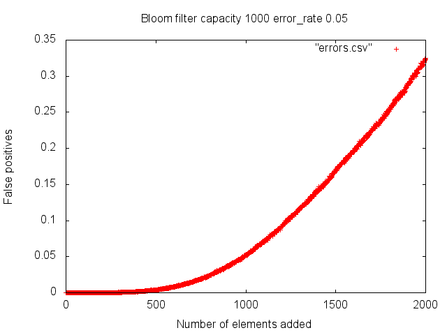

# Bloom filter in Ocaml #

The aim is to have a generic bloom filter, usable with various problem domains.
A simple version, parametrized by hash function and bit storage
is in [bloomf.ml](bloomf.ml).
This is the one to use for now, as follows:

```
utop # let bf = create 1_000;;
val bf : t = {capacity = 1000; bits = <abstr>; nhash = 7}
utop # add bf "un";;
bool = false
utop # add bf "un";;
bool = true
utop # add bf "one";;
- : bool = false
```

The filter performance degrades rapidly when its niminal capaciry is exceeded:


-------------------------------------------------------------------------------

The rest is incomplete and subject to large changes..

TODOs, in no particular order:
- [ ] make init parameters more flexible
- [x] ~~provide reset~~. done
- [ ] make growable
- [x] ~~add byte array storage~~. done
- [x] ~~add mapped files storage~~. To be intgrated with simple filter.
- [ ] add memcached like distributed memory storage
- [ ] make this a distributed service with distributed hash table
- [ ] provide save/load
- [ ] provide statistics
- [ ] set operations like union, intersection
- [ ] multilevel hashing to improve locality wrt problem domain

